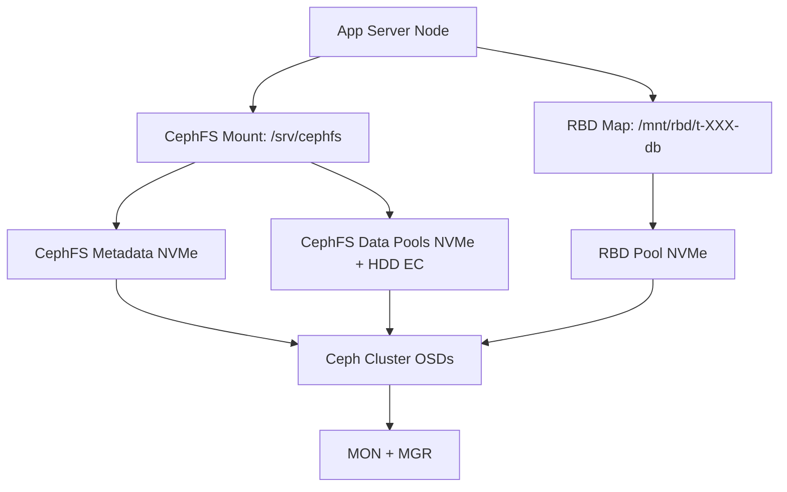

# Artipod Artifact Studio — Architecture & Implementation Guide

---

## Executive Summary

Artipod Artifact Studio is designed to provide a **GitHub-like multi-tenant artifact and repo environment** with:

* **Hyperconverged Ceph storage** (NVMe + HDD) powering both POSIX (CephFS) and block (RBD) backends.
* **Tenant isolation** with encryption and per-request bind-mounts.
* **Virtualized interactive consoles** via Docker containers per tenant, presenting a secure command-line experience.
* **Blob storage** (images, videos, binaries, Git-LFS) backed by Ceph RGW (S3 API).
* **DuckDB RDB** for fast serverless database performance. 
* **Balanced performance tiers** through CephFS multiple data pools and RBD NVMe pool.

This approach balances operational simplicity (single CephFS for most tenants) with targeted performance isolation (RBD for DuckDB databases). It minimizes latency by avoiding per-request network mounts and secures tenants with encryption, namespaces, and cephx path-scoped caps.

---

## Multi-Tenant Underlay Design

**Layers:**

* **CephFS:** shared filesystem for repos, worktrees, artifacts.
* **RBD:** per-tenant block volumes for DuckDB databases.
* **RGW:** object store for blobs, Git-LFS, large binaries.
* **Pools:** NVMe for metadata + hot data, HDD EC for warm storage.

**Why:**

* Single FS simplifies ops & namespace.
* Multiple data pools enable cost/performance balance.
* RBD volumes isolate database fsync-heavy workloads.
* RGW scales effortlessly for billions of blobs.

---

## Tenant Virtual Experience

### In-App

* Tenants see only their repos, blobs, and DB.
* Transparent tiering: hot repos fast, cold repos may restore with a slight delay.
* Git-LFS seamlessly uploads large files to RGW.

### In Docker Console

* Tenant runs in a container with:

  * `/workspace/repos` → their CephFS subtree.
  * `/workspace/db` → their RBD volume (mounted as ext4/xfs).
* Container is hardened: non-root user, read-only rootfs, tmpfs scratch, no extra caps.
* Optional gocryptfs decryption ensures the tenant’s plaintext is visible only inside their container.

---

## Encryption Spec

* **At-rest:** gocryptfs encrypts tenant repos under `/srv/cephfs/tenants/t-XXX.enc`.
* **At-host:** decrypted view (`/run/tenants/t-XXX.plain`) mounted only for active sessions.
* **Keys:** per-tenant, stored in Vault/KMS, short-lived tokens at runtime.
* **Isolation:** cephx caps scoped to tenant paths; containers bind-mount only their decrypted folder.
* **Blobs (RGW):** rely on Ceph’s at-rest encryption (or S3 SSE-KMS integration).

**Why:** ensures CephFS underlay and cluster operators see only ciphertext; only app servers with tenant keys can present plaintext.

---

## Appendix — Technical Links

* **CephFS Multi-MDS:** [https://docs.ceph.com/en/latest/cephfs/](https://docs.ceph.com/en/latest/cephfs/)
* **RBD Overview:** [https://docs.ceph.com/en/latest/rbd/](https://docs.ceph.com/en/latest/rbd/)
* **RGW Object Storage:** [https://docs.ceph.com/en/latest/radosgw/](https://docs.ceph.com/en/latest/radosgw/)
* **gocryptfs:** [https://github.com/rfjakob/gocryptfs](https://github.com/rfjakob/gocryptfs)
* **Docker Security:** [https://docs.docker.com/engine/security/](https://docs.docker.com/engine/security/)
* **Git-LFS:** [https://git-lfs.github.com/](https://git-lfs.github.com/)

---

## Diary of Design Considerations

### Initial Scaling Concerns

* Q: Can one Ceph cluster handle hundreds of thousands of users?
* A: Yes, but avoid pool-per-tenant. Use shared pools + quotas; RGW scales with sharded bucket indexes.

### File System vs Block Storage

* CephFS: good for repos (many small files) but fsyncs jittery.
* RBD: better for DuckDB (database file with heavy fsync).
* Decision: CephFS for repos, RBD for DuckDB → **best of both worlds**.

### Tenant Isolation

* Wanted tenants to only see their subtree.
* Solutions explored: cephx path caps, NFS Ganesha exports, mount namespaces.
* Decision: single host CephFS mount + per-tenant bind-mount + chroot/pivot → instant, safe isolation.

### On-Demand vs Persistent Mounts

* Mount/unmount CephFS per request too slow.
* Decision: single persistent host mount, instant bind mounts for requests.

### Encryption

* Goal: ensure underlay cannot read tenant data.
* Explored: fscrypt, eCryptfs, gocryptfs, CryFS.
* Decision: **gocryptfs** → fast, filename encryption, supports hardlinks (needed by Git).

### Tenant Console UX

* Requirement: give users a CLI-like experience.
* Explored: direct host access vs container.
* Decision: Docker containers, hardened (non-root, seccomp, no caps), bind mounts for repos + DB.

### Blob Storage

* Git-LFS, images, media files don’t belong in CephFS.
* Decision: RGW object store with lifecycle to cold tier. Integrates with Git-LFS natively.

### Why This Hybrid Design?

* Single CephFS for operational simplicity & repo semantics.
* RBD for performance-sensitive databases.
* RGW for infinite-scale blobs.
* Encryption to enforce zero-knowledge underlay.

---

**Artipod Artifact Studio** = a unified, secure, multi-tenant environment that feels like a personal studio for each tenant, but scales operationally like a cloud platform.
