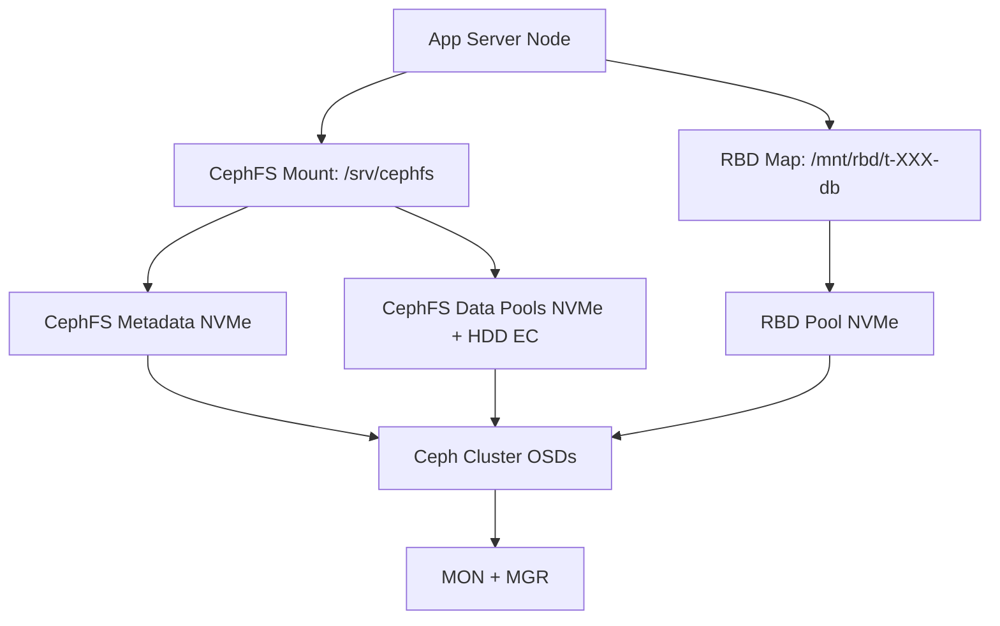
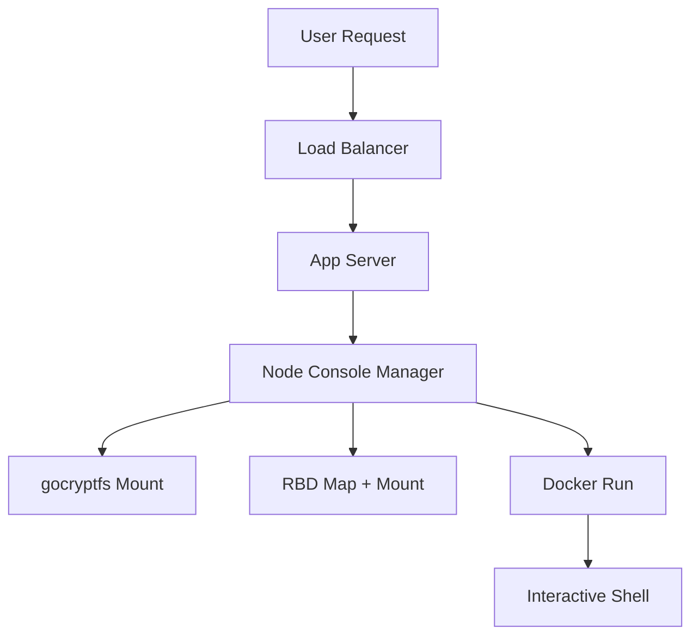

# Artipod Artifact Studio — Architecture & Implementation Guide

---

## Executive Summary

Artipod Artifact Studio is designed to provide a **GitHub-like multi-tenant artifact and repo environment** with:

* **Hyperconverged Ceph storage** (NVMe + HDD) powering both POSIX (CephFS) and block (RBD) backends.
* **Tenant isolation** with encryption and per-request bind-mounts.
* **Virtualized interactive consoles** via Docker containers per tenant, presenting a secure command-line experience.
* **Blob storage** (images, videos, binaries, Git-LFS) backed by Ceph RGW (S3 API).
* **DuckDB RDB** for fast serverless database performance. 
* **Balanced performance tiers** through CephFS multiple data pools and RBD NVMe pool.

This approach balances operational simplicity (single CephFS for most tenants) with targeted performance isolation (RBD for DuckDB databases). It minimizes latency by avoiding per-request network mounts and secures tenants with encryption, namespaces, and cephx path-scoped caps.

---

## Multi-Tenant Underlay Design



**Layers:**

* **CephFS:** shared filesystem for repos, worktrees, artifacts.
* **RBD:** per-tenant block volumes for DuckDB databases.
* **RGW:** object store for blobs, Git-LFS, large binaries.
* **Pools:** NVMe for metadata + hot data, HDD EC for warm storage.

**Why:**

* Single FS simplifies ops & namespace.
* Multiple data pools enable cost/performance balance.
* RBD volumes isolate database fsync-heavy workloads.
* RGW scales effortlessly for billions of blobs.

---

## Tenant Virtual Experience

### In-App

* Tenants see only their repos, blobs, and DB.
* Transparent tiering: hot repos fast, cold repos may restore with a slight delay.
* Git-LFS seamlessly uploads large files to RGW.

### In Docker Console

* Tenant runs in a container with:

  * `/workspace/repos` → their CephFS subtree.
  * `/workspace/db` → their RBD volume (mounted as ext4/xfs).
* Container is hardened: non-root user, read-only rootfs, tmpfs scratch, no extra caps.
* Optional gocryptfs decryption ensures the tenant’s plaintext is visible only inside their container.



---

## Encryption Spec

* **At-rest:** gocryptfs encrypts tenant repos under `/srv/cephfs/tenants/t-XXX.enc`.
* **At-host:** decrypted view (`/run/tenants/t-XXX.plain`) mounted only for active sessions.
* **Keys:** per-tenant, stored in Vault/KMS, short-lived tokens at runtime.
* **Isolation:** cephx caps scoped to tenant paths; containers bind-mount only their decrypted folder.
* **Blobs (RGW):** rely on Ceph’s at-rest encryption (or S3 SSE-KMS integration).

**Why:** ensures CephFS underlay and cluster operators see only ciphertext; only app servers with tenant keys can present plaintext.

---

## Appendix — Technical Links

* **CephFS Multi-MDS:** [https://docs.ceph.com/en/latest/cephfs/](https://docs.ceph.com/en/latest/cephfs/)
* **RBD Overview:** [https://docs.ceph.com/en/latest/rbd/](https://docs.ceph.com/en/latest/rbd/)
* **RGW Object Storage:** [https://docs.ceph.com/en/latest/radosgw/](https://docs.ceph.com/en/latest/radosgw/)
* **gocryptfs:** [https://github.com/rfjakob/gocryptfs](https://github.com/rfjakob/gocryptfs)
* **Docker Security:** [https://docs.docker.com/engine/security/](https://docs.docker.com/engine/security/)
* **Git-LFS:** [https://git-lfs.github.com/](https://git-lfs.github.com/)

---

## Diary of Design Considerations

### Initial Scaling Concerns

* Q: Can one Ceph cluster handle hundreds of thousands of users?
* A: Yes, but avoid pool-per-tenant. Use shared pools + quotas; RGW scales with sharded bucket indexes.

### File System vs Block Storage

* CephFS: good for repos (many small files) but fsyncs jittery.
* RBD: better for DuckDB (database file with heavy fsync).
* Decision: CephFS for repos, RBD for DuckDB → **best of both worlds**.

### Tenant Isolation

* Wanted tenants to only see their subtree.
* Solutions explored: cephx path caps, NFS Ganesha exports, mount namespaces.
* Decision: single host CephFS mount + per-tenant bind-mount + chroot/pivot → instant, safe isolation.

### On-Demand vs Persistent Mounts

* Mount/unmount CephFS per request too slow.
* Decision: single persistent host mount, instant bind mounts for requests.

### Encryption

* Goal: ensure underlay cannot read tenant data.
* Explored: fscrypt, eCryptfs, gocryptfs, CryFS.
* Decision: **gocryptfs** → fast, filename encryption, supports hardlinks (needed by Git).

### Tenant Console UX

* Requirement: give users a CLI-like experience.
* Explored: direct host access vs container.
* Decision: Docker containers, hardened (non-root, seccomp, no caps), bind mounts for repos + DB.

### Blob Storage

* Git-LFS, images, media files don’t belong in CephFS.
* Decision: RGW object store with lifecycle to cold tier. Integrates with Git-LFS natively.

### Why This Hybrid Design?

* Single CephFS for operational simplicity & repo semantics.
* RBD for performance-sensitive databases.
* RGW for infinite-scale blobs.
* Encryption to enforce zero-knowledge underlay.

---

**Artipod Artifact Studio** = a unified, secure, multi-tenant environment that feels like a personal studio for each tenant, but scales operationally like a cloud platform.

https://chatgpt.com/share/68be9903-f71c-8004-9621-19505653bd68

---

## Proxmox Implementation Guide

This guide provides high-level steps to bootstrap Artipod Artifact Studio on Proxmox, integrating CephFS, RBD, gocryptfs, and Docker. It starts with a 3-node setup and outlines scaling to 20 nodes.

### Prerequisites
- 3+ servers with Proxmox VE compatible hardware (NVMe for OSDs, HDD for storage).
- Network configured for cluster communication.
- SSH access to all nodes.

### Step 1: Install Proxmox VE on 3 Nodes
1. Download the latest Proxmox VE ISO from [proxmox.com](https://www.proxmox.com/en/downloads).
2. Boot each server from the ISO and follow the installation wizard.
   - Set hostname (e.g., proxmox01, proxmox02, proxmox03).
   - Configure network interfaces.
   - Install to local disk.
3. After installation, update the system:
   ```
   apt update && apt upgrade -y
   ```
4. Repeat for all 3 nodes.

### Step 2: Create Proxmox Cluster
1. On the first node (proxmox01):
   ```
   pvecm create artipod-cluster
   ```
2. On the second and third nodes:
   ```
   pvecm add <IP_of_proxmox01>
   ```
   - Follow prompts to join the cluster.
3. Verify cluster status:
   ```
   pvecm status
   ```

### Step 3: Install and Configure Ceph
1. On each node, install Ceph:
   ```
   apt install cephadm -y
   ```
2. On proxmox01, bootstrap the Ceph cluster:
   ```
   cephadm bootstrap --mon-ip <IP_of_proxmox01>
   ```
   - This creates the initial monitor and manager.
3. Add the other nodes to Ceph:
   ```
   ceph orch host add proxmox02 <IP_of_proxmox02>
   ceph orch host add proxmox03 <IP_of_proxmox03>
   ```
4. Add OSDs (assuming disks are available):
   ```
   ceph orch daemon add osd <host>:<device>
   ```
   - Repeat for NVMe and HDD devices across nodes.

### Step 4: Configure Ceph Pools and Services
1. Create pools for CephFS:
   ```
   ceph osd pool create cephfs_meta 32
   ceph osd pool create cephfs_data 128
   ```
2. Create CephFS filesystem:
   ```
   ceph fs new artipod_fs cephfs_meta cephfs_data
   ```
3. Create RBD pool:
   ```
   ceph osd pool create rbd 128
   rbd pool init rbd
   ```
4. Deploy RGW for object storage:
   ```
   ceph orch apply rgw artipod-rgw --realm=artipod --zone=artipod-zone
   ```

### Step 5: Mount CephFS and Set Up Encryption with gocryptfs
1. On each app server node, install gocryptfs:
   ```
   apt install gocryptfs -y
   ```
2. Mount CephFS persistently:
   ```
   echo "<mon_ips>:/ /srv/cephfs ceph name=admin,secret=<ceph_key> 0 0" >> /etc/fstab
   mount /srv/cephfs
   ```
3. For each tenant (e.g., t-001), create encrypted directory:
   ```
   mkdir /srv/cephfs/tenants/t-001.enc
   gocryptfs -init /srv/cephfs/tenants/t-001.enc
   ```
   - Store the master key securely (e.g., in Vault).
4. Mount decrypted view on-demand:
   ```
   gocryptfs /srv/cephfs/tenants/t-001.enc /run/tenants/t-001.plain
   ```

### Step 6: Install and Configure Docker
1. On app server nodes, install Docker:
   ```
   apt install docker.io -y
   systemctl enable docker
   systemctl start docker
   ```
2. Pull base images for tenant consoles:
   ```
   docker pull ubuntu:20.04
   ```
3. Run a sample tenant container:
   ```
   docker run -it --rm \
     --mount type=bind,source=/run/tenants/t-001.plain,target=/workspace/repos \
     --mount type=bind,source=/mnt/rbd/t-001-db,target=/workspace/db \
     --user 1000:1000 \
     --cap-drop ALL \
     ubuntu:20.04 /bin/bash
   ```
   - Adjust mounts for RBD (see below).

### Step 7: Configure RBD Volumes for Databases
1. Create RBD image for a tenant DB:
   ```
   rbd create --size 10G rbd/t-001-db
   ```
2. Map and format on the host:
   ```
   rbd map rbd/t-001-db
   mkfs.ext4 /dev/rbd/rbd/t-001-db
   mount /dev/rbd/rbd/t-001-db /mnt/rbd/t-001-db
   ```
3. Bind-mount into Docker containers as needed.

### Scaling to 20 Nodes
1. **Add Proxmox Nodes:**
   - Install Proxmox on new servers (nodes 4-20).
   - Join them to the cluster:
     ```
     pvecm add <IP_of_existing_node>
     ```

2. **Expand Ceph Cluster:**
   - Add new hosts:
     ```
     ceph orch host add proxmox04 <IP_of_proxmox04>
     ```
   - Add OSDs from new nodes:
     ```
     ceph orch daemon add osd proxmox04:<device>
     ```
   - Increase pool PGs if needed:
     ```
     ceph osd pool set cephfs_data pg_num 256
     ```

3. **Balance Load:**
   - Ensure monitors and managers are distributed.
   - Add more RGW instances if blob traffic increases:
     ```
     ceph orch apply rgw artipod-rgw --placement="4 proxmox01 proxmox02 proxmox03 proxmox04"
     ```

4. **Update Mounts and Encryption:**
   - Ensure new app server nodes have CephFS mounts and gocryptfs set up.
   - Distribute tenant keys securely.

5. **Monitor and Optimize:**
   - Use Ceph dashboard: `ceph mgr module enable dashboard`
   - Monitor performance and adjust CRUSH rules for data placement.

This guide provides a foundation; refer to official Ceph and Proxmox documentation for detailed configurations and troubleshooting.

