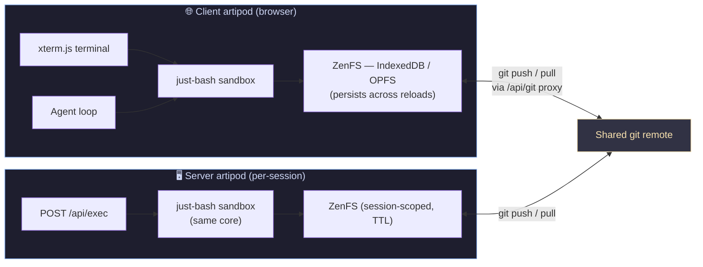
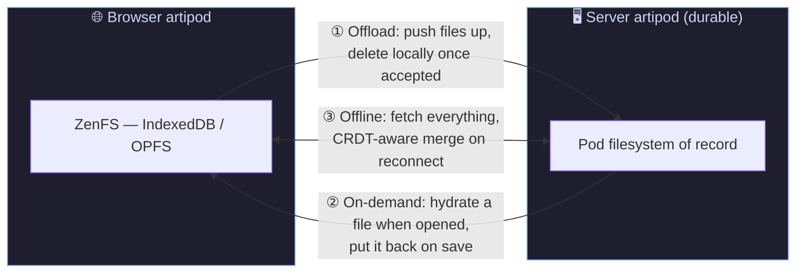

# WTF Is This?
 
An **artipod** is a self-contained work pod — bash, a filesystem, git, and an agent loop — that can run anywhere. This app runs one artipod in your browser and links it to a twin artipod on the server: the same sandbox core (`lib/sandbox`) in two habitats, kept in sync through git.

## The Linkage Today



## How the Sync Works

- **One core, two habitats** — both pods run the identical framework-free sandbox (`createSandbox`): just-bash over ZenFS, with git as a trusted command.
- **The repo is the sync unit** — clone the same repo in both pods; `git push` / `git pull` moves work between them through the self-hosted, host-allowlisted CORS proxy (`/api/git`).
- **Different lifetimes** — the client pod persists across reloads (IndexedDB/OPFS); the server pod is a TTL-evicted session, so push before it expires.
- **Agent runs in either pod** — the browser Agent tab or a server `/api/exec` session: same tools, same shell, same tree.

The ideal loop: sketch a change in the client pod and push; the server pod pulls, runs the heavier work, and pushes back; the client pulls. Two pods, one repo, no divergence.

## Planned: Direct Pod Linkage

Today the pods only meet at a git remote. The plan is a direct sync channel between the browser pod and a durable server pod, so the browser can choose how much of the tree it holds:



Three modes, per directory or per file:

1. **Offload** — the browser pushes files up and deletes them locally as the server accepts each one. Frees IndexedDB/OPFS quota; the server pod becomes the copy of record.
2. **On-demand** — the local tree is a sparse view. Opening a file hydrates it from the server pod; saving puts it back. Only what you touch lives in the browser.
3. **Offline** — fetch the full tree and work disconnected. Both pods keep editing; on reconnect a CRDT-aware merge reconciles changes without losing either side's edits.

Git stays the versioning layer underneath all three — the sync channel moves working-tree state between pods; commits still mark the durable history.

### Phase 2 Option: Relay the Shell

Beyond syncing files, the terminal itself can relay a command to the server pod — same prompt, remote muscle. With the tree synced, the output is as if it ran locally:

```
+------------------------------------------------------+
|                       BROWSER                        |
|  +----------+    +-----------+    +---------------+  |
|  | xterm.js |--->| just-bash |--->| ZenFS         |  |
|  | Terminal |    | (local)   |    | (IndexedDB)   |  |
|  +----------+    +-----------+    +---------------+  |
|       |                                              |
|       | `remote <cmd>`  (phase 2 option)             |
|       v                                              |
|  +------------------------------------------------+  |
|  |        POST /api/exec  { cmd, session }        |  |
|  +------------------------------------------------+  |
+----------------------------|-------------------------+
                             |
                             v
+------------------------------------------------------+
|                       SERVER                         |
|  +-----------+    +-----------+    +---------------+ |
|  | exec      |--->| just-bash |--->| ZenFS         | |
|  | session   |    | (same     |    | (session,     | |
|  | (TTL)     |    |  core)    |    |  synced tree) | |
|  +-----------+    +-----------+    +---------------+ |
|       |                                              |
|       | stdout / stderr / exit code                  |
+-------|----------------------------------------------+
        |
        v
   back into the same xterm prompt
```