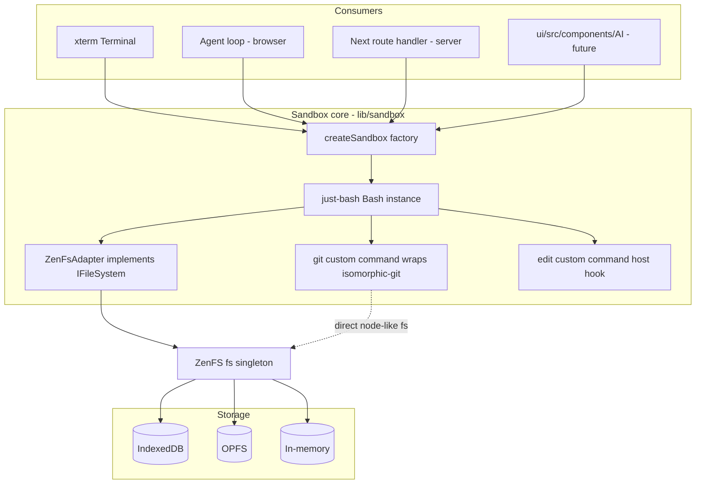

# just-bash Integration Plan for artipod-sync

**Status**: Draft for developer handoff
**Date**: 2026-08-04
**Owner**: horner

## 1. Context & Goals

artipod-sync is currently a browser Git shell PoC: ZenFS (IndexedDB) + isomorphic-git + xterm.js + a hand-rolled command parser ([lib/shell.ts](lib/shell.ts)). We are replacing the hand-rolled parser with [just-bash](https://github.com/vercel-labs/just-bash) (a full bash interpreter in TypeScript with a pluggable virtual filesystem) and growing artipod-sync into a reusable sandbox foundation.

**Goals (in priority order):**

1. **Command line in browser** — real bash semantics (pipes, redirects, globs, vars, loops, ~90 coreutils) in the xterm terminal, over the persistent ZenFS filesystem.
2. **Command line on server** — the same sandbox core running in Node (Next.js route handler / standalone), so agents and users get identical behavior server-side.
3. **Agents in browser** — an LLM tool-calling loop where the model's `bash` tool executes inside the sandbox (Ozwell OpenAI-compatible API, and later on-device models).
4. **OPFS support** — support OPFS (`WebAccess` backend) alongside IndexedDB, selectable + migratable.
5. **Foundation for `ui/src/components/AI`** — the sandbox becomes the workspace that in-browser models (Transformers.js / WebLLM / Ozwell remote) operate within, consumable by AIChat/HeyOzwell-style components.

**Non-goal:** upstreaming git into just-bash core. git violates just-bash's network-firewall design (isomorphic-git brings its own HTTP stack), so git stays a *host-provided custom command* here. Later we may upstream the generic ZenFS adapter as an example/PR.

## 2. Current State

| Piece | File | Notes |
|---|---|---|
| FS init | [lib/filesystem.ts](lib/filesystem.ts) | ZenFS `configure` with IndexedDB at `/`; uses `existsSync`/`mkdirSync` (sync API) |
| Git ops | [lib/git.ts](lib/git.ts) | isomorphic-git + `http/web` + `cors.isomorphic-git.org`; clone/status/listFiles/diff |
| Shell | [lib/shell.ts](lib/shell.ts) | Hand-rolled parser: `ls`, `cd`, `pwd`, `cat`, `git`, `edit`, `help`. **To be replaced.** |
| Terminal | [components/Terminal.tsx](components/Terminal.tsx) | xterm.js, line editing + history in-component |
| Editor / tree | [components/Editor.tsx](components/Editor.tsx), [components/FileTree.tsx](components/FileTree.tsx) | Monaco + react-complex-tree, direct ZenFS access |
| Deps | package.json | `@zenfs/core@2.4.4`, `@zenfs/dom@1.2.5` (has `IndexedDB` **and** `WebAccess`/OPFS backends), `isomorphic-git@^1.25`, no just-bash yet |

**Reference material in sibling repos (same workspace):**

- just-bash source: `../just-bash/packages/just-bash/` — esp. `src/fs/interface.ts` (the `IFileSystem` contract), `src/browser.ts` (browser entry exports), `src/cli/shell.ts` (their REPL host).
- Agent loop to port: `../ozwell-artipod/src/toolCallingLoop.ts`, `ozwellClient.ts`, `tools.ts`, `types.ts` (OpenAI-compatible tool calling).
- AI-SDK-based alternative: `../just-bash/examples/bash-agent/agent.ts` (`bash-tool` npm + Vercel `ai` SDK).
- Consumer target: `../ui/src/components/AI/` (AIChat, MCPToolCall, ozwellChat.ts, on-device Whisper worker pattern in whisperTranscribe.ts).

## 3. Target Architecture



Key design decisions:

1. **ZenFS stays the single source of truth.** just-bash sees it through a `ZenFsAdapter` (implements just-bash's `IFileSystem`); isomorphic-git keeps using the ZenFS node-like `fs` object directly. Same backing store → shell view and git view are always coherent.
2. **git is a just-bash custom command** (`defineCommand("git", ...)`) delegating to `lib/git.ts`. It runs trusted, in-page, and its network goes through the CORS proxy — *outside* just-bash's network firewall. This is deliberate and must be documented in the security notes.
3. **`lib/sandbox/` must stay framework-free** — no React, no Next, no `window` at module top level. That is what makes it reusable on the server (goal 2) and extractable for `ui/` (goal 5).
4. **One adapter, two runtimes.** ZenFS core is platform-agnostic; the same `ZenFsAdapter` works in Node with an in-memory (or other) backend. Server-side we can *also* offer just-bash's native `OverlayFs`/`ReadWriteFs` for real-disk workspaces (no git there initially — isomorphic-git would need a reverse facade; defer).

### Proposed module layout

```
lib/
  sandbox/
    index.ts           # createSandbox(), Sandbox type — the only public entry
    zenfs-adapter.ts   # ZenFsAdapter implements IFileSystem
    git-command.ts     # defineCommand('git', ...) → gitOps
    edit-command.ts    # defineCommand('edit', ...) → host onEdit hook
    storage.ts         # backend select/detect/migrate (browser only, lazy-imported)
    types.ts
  agent/
    loop.ts            # ToolCallingLoop (ported from ozwell-artipod, browser-safe)
    ozwell-client.ts   # OpenAI-compatible client (fetch-based, works browser+server)
    tools.ts           # bash tool (+ read_file/write_file convenience tools)
  git.ts               # (existing) extend subcommands
  filesystem.ts        # (existing) refactor → storage.ts, keep back-compat export
app/
  api/exec/route.ts    # Phase 5: server exec endpoint
  api/git/[...proxy]/route.ts  # Phase 5 (optional): self-hosted CORS proxy
components/
  Terminal.tsx         # rewire onCommand → sandbox.exec
```

## 4. Phases

### Phase 0 — Prep (small, do first)

- [x] `npm i just-bash` (v3.x). Import **only** from `just-bash/browser` in client code (the root entry pulls Node-only modules: OverlayFs/ReadWriteFs/Sandbox).
- [x] Refactor [lib/filesystem.ts](lib/filesystem.ts) to be **async-only** (`fs.promises.*`; replace `existsSync`/`mkdirSync`). Rationale: the OPFS backend (`WebAccessFS`) is async-mixin based — sync calls are not reliable there. Keep the `fs` export for git/editor/tree.
- [x] Replace the CJS `require('@zenfs/core')` window-guard with dynamic `import()` inside `initFileSystem()`; components already gate on `fsReady`.
- [x] Add `vitest` (or keep it out of Next's build) for unit tests of the adapter; add Playwright for e2e later phases.

**Acceptance:** app behaves exactly as today (clone/ls/cat/edit/diff work; files persist across reload).

### Phase 1 — ZenFsAdapter + Bash terminal (the core swap)

**1a. Implement `lib/sandbox/zenfs-adapter.ts`**

Implement just-bash's `IFileSystem` (see `../just-bash/packages/just-bash/src/fs/interface.ts` — implement the *whole* interface incl. `symlink`, `readlink`, `realpath`, `chmod`, `appendFile`, `mv`, `cp`). Mapping is mostly 1:1 onto `fs.promises`:

```ts
import type { IFileSystem, FsStat } from "just-bash/browser";

export class ZenFsAdapter implements IFileSystem {
  constructor(private zfs: typeof import("@zenfs/core").fs) {}

  async readFile(path: string, options?): Promise<string> {
    return this.zfs.promises.readFile(path, normalizeEnc(options) ?? "utf8") as Promise<string>;
  }
  async readFileBuffer(path: string): Promise<Uint8Array> {
    return new Uint8Array(await this.zfs.promises.readFile(path));
  }
  async stat(path: string): Promise<FsStat> {
    const s = await this.zfs.promises.lstat(path);   // lstat: symlink-aware
    return {
      isFile: s.isFile(), isDirectory: s.isDirectory(), isSymbolicLink: s.isSymbolicLink(),
      mode: s.mode, size: s.size, mtime: s.mtime,
      ino: s.ino, identity: `${s.dev}:${s.ino}`,      // helps cp/mv cycle detection
    };
  }
  resolvePath(base: string, p: string): string { /* POSIX resolve, no fs access */ }
  getAllPaths(): string[] { return []; }             // see note below
  // ... remaining methods; rm maps to promises.rm({recursive,force}),
  // cp: implement recursive copy manually if zenfs cp is unavailable,
  // mv: promises.rename with cross-check, readdirWithFileTypes via
  // promises.readdir(path, { withFileTypes: true }) for glob performance.
}
```

Notes/gotchas discovered while reading just-bash source:

- **Sync methods are banned** in `IFileSystem` — everything is async except `getAllPaths()` and `resolvePath()`. `resolvePath` is pure string math (copy the POSIX resolution from just-bash's `InMemoryFs`).
- **`getAllPaths()`** is only used by `ls` when it receives an unexpanded glob pattern (`listGlob` in `src/commands/ls/ls.ts`). Shell glob expansion itself is `readdir`-based and works fine through the adapter. Start with `return []` (degrades one `ls` edge case); optionally later maintain an in-memory path index updated on write/mkdir/rm/mv.
- **Implement `readdirWithFileTypes`** (optional in the interface) — just-bash's glob engine prefers it and it avoids N stat calls per directory.
- **`readFileBytes` (optional)** returns just-bash's latin1-shaped `ByteString`; skip it initially — just-bash falls back to `readFileBuffer`.
- **Error shape:** just-bash matches on `Error` with node-ish messages (`ENOENT`-style). ZenFS throws `ErrnoError` with `code` — pass them through unchanged; verify `cat missing.txt` produces a sensible message in tests.
- **Contract tests:** mirror `../just-bash/packages/just-bash/src/fs/interface.contract.test.ts` against `ZenFsAdapter` over an in-memory ZenFS — this is the highest-value test in the whole plan.

**1b. `lib/sandbox/git-command.ts` + `edit-command.ts`**

```ts
import { defineCommand } from "just-bash/browser";
import { gitOps } from "../git";

export const makeGitCommand = () =>
  defineCommand("git", async (args, ctx) => {
    // ctx.cwd is the shell's cwd — use it as the repo dir
    const [sub, ...rest] = args;
    try {
      switch (sub) {
        case "clone":  await gitOps.clone(rest[0], ctx.cwd); return ok("Cloned.\n");
        case "status": return ok(renderStatus(await gitOps.status(ctx.cwd)));
        // ... diff, files, and Phase-3 subcommands
        default: return err(`git: '${sub}' is not supported\n`, 1);
      }
    } catch (e) { return err(`git: ${(e as Error).message}\n`, 1); }
  });
```

`edit` becomes `defineCommand("edit", ...)` that resolves `args[0]` against `ctx.cwd` and calls the host `onEdit(path)` callback (passed into `createSandbox`).

**1c. `lib/sandbox/index.ts` — the factory**

```ts
import { Bash } from "just-bash/browser";

export interface Sandbox {
  exec(line: string): Promise<{ stdout: string; stderr: string; exitCode: number }>;
  getCwd(): string;
  fs: ZenFsAdapter;
}

export function createSandbox(opts: { onEdit?: (p: string) => void }): Sandbox {
  const adapter = new ZenFsAdapter(zfs);
  const bash = new Bash({
    fs: adapter,
    cwd: "/repo",
    env: { HOME: "/repo", USER: "user", TERM: "xterm-256color" },
    customCommands: [makeGitCommand(), makeEditCommand(opts.onEdit)],
    // executionLimits: tune later; defaults are sane
  });

  let cwd = "/repo";
  return {
    async exec(line) {
      const r = await bash.exec(line, { cwd });
      // CRITICAL: just-bash isolates state per exec() BY DESIGN — cd/export
      // do not persist. Recover the final cwd from the result env:
      if (r.env?.PWD) cwd = r.env.PWD;
      return r;
    },
    getCwd: () => cwd,
    fs: adapter,
  };
}
```

> **Why we do this**: per-`exec` state isolation is deliberate upstream (Bash.ts: *"Each exec call gets an isolated state copy - like starting a new shell"*), documented in their README/AGENTS.npm.md, and pinned by a test (`cd does not persist across exec calls`). Rationale: concurrent `exec` safety + preventing cross-turn state contamination for agents (see CHANGELOG #307 transactional state rollback). Don't fight it; reconstruct the session host-side.
>
> just-bash's own REPL (`src/cli/shell.ts`) does **not** persist `cd` between lines — we do better via `result.env.PWD` (`cd` writes `PWD`/`OLDPWD` into `state.env`, and `result.env` is that map). Env/shell vars can be carried the same way by passing `result.env` into the next `exec`.
>
> **Known ceiling — functions only.** `BashExecResult` exposes `stdout/stderr/exitCode/env/metadata`. Most session state can still be reconstructed:
>
> | State | How it carries across lines |
> |---|---|
> | cwd | `result.env.PWD` → pass as `exec(line, { cwd })` |
> | variables + exports | replay `result.env` into the next `exec` |
> | **aliases** | **free** — stored in the env map as `BASH_ALIAS_<name>` (`commands/alias/alias.ts`), so env replay carries them. *Implementation detail, not a documented contract — pin it with a test.* |
> | `shopt` / `set -o` / `complete` | not in env; dump with `shopt -p` / `complete -p` and prepend as a prelude |
> | **functions** | **hard gap** — `declare -f` prints `# function body` because just-bash doesn't retain function source (`builtins/declare.ts`) |
>
> Mitigation for functions: **host-side prelude accumulation** — when an input line is a pure definition, keep it in a prelude buffer and prepend it to subsequent execs. Robust detection wants the AST; note `parse` is exported from the root entry but **not** from `just-bash/browser` (see §10 upstream PRs). Ship v1 with a documented limitation in `help` and revisit if users hit it.

**1d. Rewire [components/Terminal.tsx](components/Terminal.tsx) / [app/page.tsx](app/page.tsx)**

- `Shell` class is deleted; `onCommand` calls `sandbox.exec(line)`; print `stdout` then `stderr` (stderr in red via ANSI), prompt shows `getCwd()`.
- Keep xterm history handling as-is.

**Acceptance (Phase 1):**

- `git clone <url>` then `ls | wc -l`, `grep -rn TODO . | head -5`, `cat README.md | sed -n '1,10p'`, `for f in *.md; do wc -l "$f"; done` all work in the browser.
- `cd` persists across terminal lines; prompt reflects cwd. Variables and aliases persist too (env replay); a test pins the `BASH_ALIAS_` behavior.
- `edit README.md` opens Monaco; `git diff README.md` shows the change after save.
- Files persist across reload.
- Adapter contract test suite green.
- Bundle check: just-bash is dynamically imported client-side (`ssr: false` route already forces client), and first-load JS growth is measured and recorded in the PR description. `gzip`/`zcat`/`tar -z` are known-broken in browser (node:zlib) — acceptable; plain `tar` works.

### Phase 1.5 — Human-shell polish (small, high perceived value)

just-bash ships more interactive-shell machinery than the agent framing suggests. Cheap wins for the human terminal:

- [ ] **Tab completion** — the `compgen` / `complete` / `compopt` builtins exist. Bind Tab in xterm to a hidden `compgen -c/-f/-d "$prefix"` exec and render the candidates. Falls back to `getCommandNames()` (exported from `just-bash/browser`) + adapter `readdir` for path completion.
- [ ] **History** — keep xterm's arrow-key history (already built) and mirror it into `BASH_HISTORY` env so the `history` builtin works, exactly as upstream's REPL does (`syncHistory()` in `cli/shell.ts`).
- [ ] **Prompt + stderr styling** — cwd in the prompt via `getCwd()`, stderr in red, honor `clear`.
- [ ] **Ctrl+C** → `AbortController` into `exec(line, { signal })`.
- [ ] `help` text documenting the per-line shell semantics and the function-definition limitation.

**Known human-shell gaps (document, don't fight):** no TTY, so mid-command interactive prompts (`read -p`, `read -s`), pagers (`less`), and editors (`vim`) don't work — `edit` opens Monaco instead. `&` is parsed but there's no real job control (`wait` is a no-op stub). `ls` has no `--color`. Upstream's own KNOWN_LIMITATIONS.md deprioritizes TTY/history features as "interactive, out of scope" — that's the boundary we live inside.

### Phase 2 — OPFS support (both backends, selectable + migration)

`@zenfs/dom@1.2.5` ships `WebAccess` (OPFS) alongside `IndexedDB`. Add `lib/sandbox/storage.ts`:

```ts
export type StorageBackend = "opfs" | "indexeddb" | "memory";

export async function initFileSystem(pref?: StorageBackend) {
  const { configure, InMemory } = await import("@zenfs/core");
  const { IndexedDB, WebAccess } = await import("@zenfs/dom");
  const backend = pref ?? loadPref() ?? (await supportsOpfs() ? "opfs" : "indexeddb");
  const mount =
    backend === "opfs"
      ? { backend: WebAccess, handle: await navigator.storage.getDirectory() }
      : backend === "indexeddb"
        ? { backend: IndexedDB, storeName: "browser-git-fs" }
        : { backend: InMemory };
  await configure({ mounts: { "/": mount } });
}
```

Tasks:

- [ ] Feature-detect OPFS: `navigator.storage?.getDirectory` + try/catch (Safari private mode, older Firefox). Fall back to IndexedDB.
- [ ] Persist the choice in `localStorage`; expose a small settings UI (storage backend + `navigator.storage.estimate()` usage meter + "Request persistence" via `navigator.storage.persist()`).
- [ ] **Migration**: `migrateStorage(from, to)` — mount source at `/` and target at `/__migrate`, recursive copy, verify file count/bytes, flip the pref, reload. Show progress (repos can be thousands of files).
- [ ] **Multi-tab guard**: two tabs on the same store will corrupt state (ZenFS instances don't sync). Acquire a Web Lock (`navigator.locks.request('artipod-sync-fs', ...)`) on boot; second tab gets a read-only "already open elsewhere" banner.
- [ ] Verify the exact ZenFS 2.4/dom 1.2 option names against their docs (`storeName` vs legacy `name` — current code uses `name`).

**Acceptance:** clone on IndexedDB → migrate → everything works on OPFS (and vice versa); reload persistence on both; graceful fallback when OPFS unavailable.

### Phase 3 — Fuller git

Extend [lib/git.ts](lib/git.ts) + the `git` custom command:

- [ ] `git add <path>|.`, `git reset <path>`, `git rm`
- [ ] `git commit -m "msg"` (author from settings; store name/email in localStorage or a `/etc/gitconfig`-style file in the sandbox)
- [ ] `git log [--oneline] [-n N]`, `git branch [-a]`, `git checkout <ref|-b name>`
- [ ] `git fetch` / `git pull` (fast-forward only initially; document merge limitation)
- [ ] `git push` — needs auth: `onAuth` hook prompting for a PAT (stored per-origin, in memory by default with opt-in localStorage; **never** commit to the sandbox fs where agents can read it — see §8)
- [ ] `git diff` without args (all modified files), `git diff --staged`
- [ ] Replace the `git status` porcelain rendering with branch + short-status format

**Acceptance:** clone → edit → add → commit → log shows the commit; push to a scratch repo on GitHub works with a PAT; e2e Playwright script covers the loop (minus push).

### Phase 4 — Agents in browser

Port the loop from `../ozwell-artipod/src/` (it is already transport-clean OpenAI-compatible `fetch`):

- [ ] `lib/agent/ozwell-client.ts` — trimmed `OzwellClient` (browser `fetch`, streaming optional later). Config: base URL + API key. For dev, any OpenAI-compatible endpoint works (Ozwell, the `ozwellai-api` reference server, OpenAI).
- [ ] `lib/agent/loop.ts` — `ToolCallingLoop` port: max iterations, `onAssistantMessage`/`onToolCall`/`onToolResult` callbacks.
- [ ] `lib/agent/tools.ts` — tool definitions + handlers bound to a `Sandbox`:
  - `bash` — `{ command: string }` → `sandbox.exec`, return `{ stdout, stderr, exitCode }` **truncated** (e.g. 16 KiB head+tail marker) to protect context windows.
  - Optional conveniences: `read_file`, `write_file`, `list_files` (they reduce token burn vs cat/echo round-trips; implement via the adapter directly).
- [ ] UI: an "Agent" tab (chat panel) beside Terminal; tool calls echo into the terminal (dimmed `$ <command>` + output) so the user sees exactly what the model did. Reuse the `onToolCall` callback for this.
- [ ] Abort button → `AbortController` through client + loop; also pass a per-exec `signal` to `bash.exec` (just-bash supports cooperative cancellation).
- [ ] Alternative kept open: Vercel `ai` SDK + `bash-tool` npm (`createBashTool({ sandbox: bash })`, see `../just-bash/examples/bash-agent/agent.ts`) — evaluate for browser compat; the Ozwell port is the primary path since it matches the mieweb stack and MCPToolCall UI conventions.

**Acceptance:** with an API key configured, "clone <repo> and summarize the README, then count TS files" runs multi-step bash tool calls visibly and answers; loop respects max-iterations and abort; a runaway `while true; do :; done` tool call is killed by just-bash execution limits, not by the tab freezing.

### Phase 5 — Server-side command line

Two server surfaces, same core:

- [ ] **`app/api/exec/route.ts`** (Node runtime, not edge): per-session sandbox registry (`Map<sessionId, Sandbox>` with TTL eviction). ZenFS also runs in Node — reuse `createSandbox` with an `InMemory` ZenFS mount so **git works server-side identically** (clone in a server sandbox). POST `{ sessionId, command }` → `{ stdout, stderr, exitCode, cwd }`.
  - Set conservative `executionLimits` and consider just-bash `network` config only if server `curl` is wanted.
  - This is the "untrusted script author" scenario from just-bash's THREAT_MODEL — the interpreter is the sandbox; still add per-session memory caps (in-memory fs growth) and rate limiting.
- [ ] **Real-disk mode (optional, feature-flagged)**: `OverlayFs`/`ReadWriteFs` from the just-bash root entry for server workspaces on disk (reads real dir, writes CoW or direct). No isomorphic-git in this mode initially.
- [ ] **`app/api/git/[...proxy]/route.ts` (recommended)**: self-hosted CORS proxy (port of `@isomorphic-git/cors-proxy` logic) so browser git stops depending on `cors.isomorphic-git.org` (rate-limited, availability not guaranteed). Make the proxy URL configurable in [lib/git.ts](lib/git.ts); keep the public proxy as fallback for pure-static deployments.
- [ ] CLI parity note: for local dev, `npx just-bash-shell` already gives a Node REPL over a real dir; our route handler is for hosted/agent use.

**Acceptance:** `curl -X POST /api/exec` round-trips a pipeline; two sessions are isolated (files from one invisible to the other); browser clone works through the self-hosted proxy with the public proxy disabled.

### Phase 6 — Extraction for `ui/src/components/AI`

Prereq: Phases 1–4 stable. The goal is that `ui`'s AI components (AIChat/HeyOzwell, MCPToolCall) can hand a sandbox to a model — remote (Ozwell) or on-device (Transformers.js/WebLLM in a Web Worker, per the existing whisperTranscribe worker pattern).

- [ ] Extract `lib/sandbox/` + `lib/agent/` into a package (working name `@artipod/sandbox-web`): no React/Next imports (already enforced), ships ESM, peer-deps on `just-bash`, `@zenfs/core`, `@zenfs/dom`, `isomorphic-git`. artipod-sync becomes its first consumer (path or workspace dep initially — publishing can wait).
- [ ] **Tool-surface contract**: export the bash/read/write tool definitions in both OpenAI function-call JSON shape (what `ozwellChat.ts` speaks) and an MCP-style descriptor (what `MCPToolCall.tsx` renders). One source of truth, two serializers.
- [ ] **Worker topology decision** (document, then implement the simple one):
  - *v1*: model inference in its worker (existing ui pattern), sandbox + loop on the main thread. Tool calls are async anyway; xterm/Monaco/tree keep direct fs access. Simple, matches current PoC.
  - *v2 (only if main-thread jank shows)*: sandbox in a dedicated worker, RPC via postMessage; requires ZenFS single-owner rules (same multi-tab problem, same Web Locks solution).
- [ ] React bindings live in `ui`, not the package: a `useSandbox()` hook + terminal/agent components adapted to mieweb/ui conventions.

**Acceptance:** a Storybook story in `ui` runs an AIChat conversation whose tool calls execute in the sandbox, with MCPToolCall rendering each call; artipod-sync consumes the same package with zero behavior change.

## 5. Security Notes (read before Phase 4/5)

- **Trust model**: just-bash defends against *untrusted scripts* (agent output qualifies). Host hooks — our `git`/`edit` custom commands — are **trusted** and run in-page/in-process; they are the sandbox escape hatch, keep them minimal and argument-validated (e.g. `git` must not accept arbitrary URLs schemes: allow `https://` only).
- **Network split**: shell `curl` goes through just-bash's allowlist firewall (only exists if we configure `network`; default: off — keep it off in browser initially). git traffic bypasses that firewall by design; its egress control is the CORS proxy — restrict the self-hosted proxy to known git hosts (github.com, gitlab.com, …) server-side.
- **Credentials**: PATs for push live outside the sandbox fs (memory/localStorage), injected via isomorphic-git `onAuth` only. Anything inside ZenFS is readable by agent bash calls.
- **DoS**: rely on just-bash `executionLimits` (command count, loop iterations, string sizes) + per-exec `AbortSignal`; cap clone `depth`/repo size; surface storage quota errors gracefully.
- **Server**: per-session isolation, TTL eviction, request rate limits, no real-disk mode without the feature flag + path allowlist.

## 6. Testing Strategy

| Layer | Tool | What |
|---|---|---|
| Adapter | vitest | `IFileSystem` contract suite (mirror just-bash's `interface.contract.test.ts`) over in-memory ZenFS; error-shape tests (ENOENT etc.) |
| git command | vitest | clone (mock http), status/add/commit/log against a fixture repo built with isomorphic-git APIs |
| Sandbox | vitest | cwd persistence via `result.env.PWD`; pipes/globs over ZenFS; limits + abort |
| Browser e2e | Playwright | clone → pipeline commands → edit → diff → commit → reload persistence; both backends (IndexedDB + OPFS project); migration flow |
| Server | vitest + supertest-style | /api/exec session isolation; proxy host allowlist |
| Agent | vitest | loop with a scripted fake LLM (tool_calls → results → final); truncation behavior |

## 7. Risks & Mitigations

| Risk | Impact | Mitigation |
|---|---|---|
| ZenFS OPFS backend edge cases (async-only, handle caching) | Phase 2 slips | Keep IndexedDB the default until OPFS e2e is green; backend behind `storage.ts` abstraction |
| just-bash browser bundle size | slow first load | dynamic import behind fsReady spinner; measure in Phase 1 AC; code-split agent tab |
| Multi-tab corruption | data loss | Web Locks single-writer guard (Phase 2), read-only second tab |
| `exec()` state isolation surprises users (functions/aliases don't stick) | UX confusion | cwd + vars carry via `result.env`; document the ceiling in `help`; upstream session API only if it hurts |
| CORS proxy availability | clone breaks | self-hosted proxy (Phase 5); configurable URL from day 1 |
| isomorphic-git perf on huge repos in IndexedDB | freezes | keep `depth:1 --single-branch` defaults; document limits; OPFS is materially faster for many small files |
| `bash-tool`/AI SDK browser compat unknown | Phase 4 detour | Ozwell loop port is primary; AI SDK is a spike, not a dependency |

## 8. Open Questions (decide before the phase that needs them)

1. **Phase 2**: default backend once OPFS is proven — flip default to OPFS with auto-migration prompt, or stay IndexedDB?
2. **Phase 3**: push UX — PAT-only, or add GitHub device-flow OAuth (needs a tiny server endpoint → pairs with Phase 5)?
3. **Phase 4**: which endpoint is the dev default — Ozwell staging or `ozwellai-api` reference server?
4. **Phase 5**: does hosted artipod-sync need auth in front of `/api/exec` (it is arbitrary compute)? Presumably yes — whose session system?
5. **Phase 6**: package home — publish from artipod-sync repo, move to a mieweb monorepo, or fold into `mieweb/artipod` (which already owns the container-side sandbox story)?
6. Upstream later: offer `ZenFsAdapter` to just-bash as `examples/browser-git` or a generic `PromisesFsAdapter` PR? (Their `IFileSystem` docblock explicitly anticipates IndexedDB-backed custom implementations.)

## 10. Candidate upstream PRs (small, additive, likely accepted)

Do **not** commit a change to `exec()` state isolation — it's a documented contract pinned by a test, and it underpins concurrent/nested exec safety. These are the low-risk asks instead:

1. **Export `parse` (and `serialize`) from `src/browser.ts`.** Both are already public from the root entry (`src/index.ts`), but `browser.ts` omits them, so browser hosts can't do AST-level input inspection (needed for our function-prelude detection and for safe command rewriting). One-line, additive, no semantics change — highest odds.
2. **Make their own REPL persist `cd`** (`src/cli/shell.ts`): today an *interactive* shell silently drops `cd` between lines, which reads as a bug. Fixing it with the existing `result.env.PWD` mechanism changes zero core semantics and demonstrates the pattern.
3. **A `Session` / `PersistentShell` host helper** that composes `exec` with carried cwd+env (core isolation default untouched). Only worth proposing after #2 lands.
4. **`examples/browser-git`** contributing the ZenFS adapter + browser wiring (they already host `bash-agent`, `cjs-consumer`, `custom-command`, `website`).

